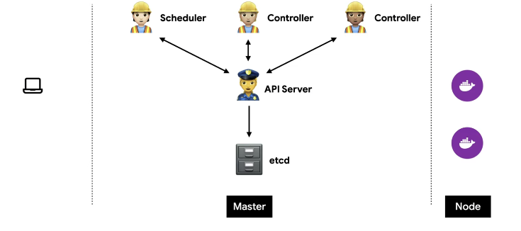

# Architecture

## Desired State

1. **상태체크(Observe) :** current state == desired state
2. **차이점 발견(Diff) :**  current state != desired state
3. **조치(Act)** : current state ⇒ desired state

 **1 ⇒ 2 ⇒ 3 ⇒ 1 … 반복**

## 도식화

**이미지 출처**

> [https://yeosong1.github.io/쿠버네티스_44초보#아키텍쳐](https://yeosong1.github.io/%EC%BF%A0%EB%B2%84%EB%84%A4%ED%8B%B0%EC%8A%A4_44%EC%B4%88%EB%B3%B4#%EC%95%84%ED%82%A4%ED%85%8D%EC%B3%90)
> 

- 스케줄러 : 새 노드 감지, 노드 라벨링
- 컨트롤러 : 하나의 목적을 위해 계속 확인 및 조치
- API Server : 소통 허브. 스케줄러, 컨트롤러 ↔ API Server ↔ etcd
- etcd : 데이터 관리, 3대 분산, 빠르고 가볍고 정확. 백업이 필수
- Master : 쿠버네티스에서 체크하고 실행하는 부분
- Node : 실제 컨테이너가 실행되는 부분

## Master

### etcd

- 모든 상태와 데이터를 저장
- 분산 시스템으로 구성하여 안전성을 높임
- 가볍고 빠르면서 정확하게 설계
- Key-Value 형태로 데이터 저장
- TTL, watch 같은 부가 기능 제공
- 백업은 필수

### API Server

- 상태를 바꾸거나 조회
- etcd와 유일하게 통신
- REST API 형태로 제공
- 권한을 체크하여 적절한 권한이 없을 경우 요청을 차단
- 관리자 요청 뿐 아니라 다양한 내부 모듈과 통신
- 수평으로 확장되도록 디자인

### Scheduler

- 새로 생성된 Pod를 감지하고 실행할 노드를 선택
- 노드의 현재 상태와 Pod의 요구사항을 체크
    - 노드에 라벨을 붙이고 특정 라벨에 해당하는 노드에 배포

### Controller

- 논리적으로 다양한 컨트롤러가 존재
    - 복제 컨트롤러
    - 노드 컨트롤러
    - 엔드포인트 컨트롤러
    - …
- 끊임 없이 상태를 체크하고 원하는 상태를 유지
- 복잡성을 낮추기 위해 하나의 프로세스로 실행
(논리적으로는 쪼개져있지만 단일 프로세스)

### 흐름

- 조회 흐름
    1. 컨트롤러 → API Server ( 정보 조회 )
    2. API Server (정보 조회 권한 체크)
    3. API Server → etcd (정보 조회)
- 기본 흐름
    1. etcd → API Server (원하는 상태 변경)
    2. API Server → Controller (원하는 상태 변경)
    3. Controller (원하는 상태로 리소스 변경)
    4. Controller → API Server (변경 사항 전달)
    5. API Server (정보 갱신 권한 체크)
    6. API Server → etcd (정보 갱신)
- API Server 통신