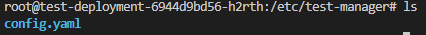

# Volume

> 파드 내의 컨테이너가 재시작되어도 데이터는 보존
> 
- 기본적으로 볼륨은 디렉토리이며, 일부 데이터가 있을 수 있고, 파드 내에서 접근 가능
- 임시 볼륨 유형과 퍼시스턴트 볼륨
    - 임시 볼륨 유형 : 파드의 수명을 가짐
    - 퍼시스턴트 볼륨 : 파드의 수명을 넘어도 삭제 X

## ConfigMap - Volume

> ConfigMap에 저장된 데이터를 파드에 주입
> 

```yaml
#(...)
spec:
   containers:
   - name: test-manager
     image: ubuntu:latest
     command: ["/bin/sh", "-ec", "while :; do echo '.'; sleep 5 ; done"]
     ports:
     - containerPort: 8080
     volumeMounts:
     - name: config #volume 이름 매칭
       mountPath: "/etc/test-manager"
       readOnly: true
   volumes:
   - name: config #volume 이름 매칭
     configMap:
       name: test-manager-configmap #configmap 이름
       items:
       - key: "config.yaml"
         path: "config.yaml"
```

⇒ 컨테이너의 /etc/test-manager 에 config.yaml 생성



## Persistent Volume(퍼시스턴트 볼륨)

- 관리자가 정적 혹은 동적(storage class)으로 프로비저닝한 클러스터의 스토리지
    - 정적 : 미리 적정 용량의 PV를 만들어 두고 사용자의 요청이 있을 시 할당
    - 동적 : PVC를 거쳐서 PV를 요청했을 때, 사용자가 원하는 용량만큼을 생성해서 사용
- Volume과 같은 볼륨 플러그인이지만 PV를 사용하는 파드와는 별개의 라이프사이클을 가짐
- **Persistent Volume Claim(PVC)**
    - 사용자의 스토리지에 대한 요청
    - PVC는 PV 리소스를 사용하며 특정 크기 및 접근 모드 요청 가능
    - PVC는 생성 시 클레임의 요구사항에 만족하는 퍼시스턴트볼륨을 찾아 바인딩 (1 : 1)
    - PVC는 파드에 설정되고 파드는 PVC를 볼륨으로 인식해서 사용
    - 파드에서 활발하게 사용 중인 PVC를 삭제 시 PVC는 즉시 삭제되지 않고, 더 이상 파드에서 적극적으로 사용되지 않을 때까지 PVC 삭제 연기 ( 치명적인 결과가 발생 가능)
    - 사용자가 볼륨을 다 사용 후, PVC 오브젝트 삭제 가능 ⇒ PV 초기화 거침(Reclaiming)
        - 반환(Reclaiming) 정책
            - Retain : PV를 그대로 보존. PV 안의 데이터는 그대로 남아있으며 재사용하기 위해선 관리자가 직접 초기화해야함
            - Delete : PV를 삭제하고 연결된 외부 스토리지 쪽의 볼륨도 삭제(동적 볼륨 할당 시 Default)
            - Recycle : PV의 데이터들을 삭제 후 다시 새로운 PVC가 PV를 사용할 수 있도록 함

## PersistentVolume - PersistentVolumeClaim - Pod

### persistentVolume.yaml

```yaml
apiVersion: v1
kind: PersistentVolume
metadata:
name: task-pv-volume
labels:
	type: local
spec:
	storageClassName: manual
	capacity:
		storage: 10Gi
	accessModes:
    - ReadWriteOnce
hostPath:
	path: "/mnt/data"
```

⇒ host의 /mnt/data 폴더를 볼륨을 지정

### persistentVolumeClaim.yaml

```yaml
apiVersion: v1
kind: PersistentVolumeClaim
metadata:
name: task-pv-claim
spec:
storageClassName: manual #PV ClassName 매칭
accessModes:
    - ReadWriteOnce
resources:
requests:
storage: 3Gi
```

### pod.yaml

```yaml
apiVersion: v1
kind: Pod
metadata:
name: task-pv-pod
spec:
	volumes:
    -name: task-pv-storage
		 persistentVolumeClaim:
			 claimName: task-pv-claim
containers:
  -name: task-pv-container
	 image: nginx
	 ports:
     -containerPort: 80
		 name: "http-server"
	 volumeMounts:
     -mountPath: "/usr/share/nginx/html"
		  name: task-pv-storage

```

⇒PV를 컨테이너의 /usr/share/nginx/html 에 마운트